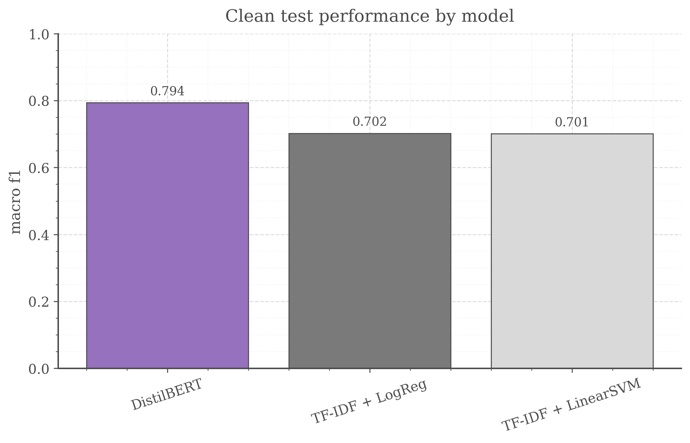
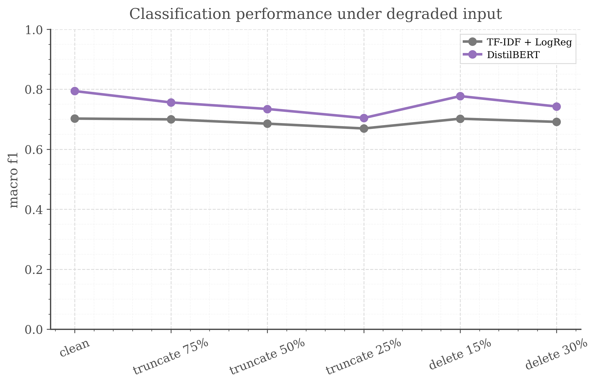
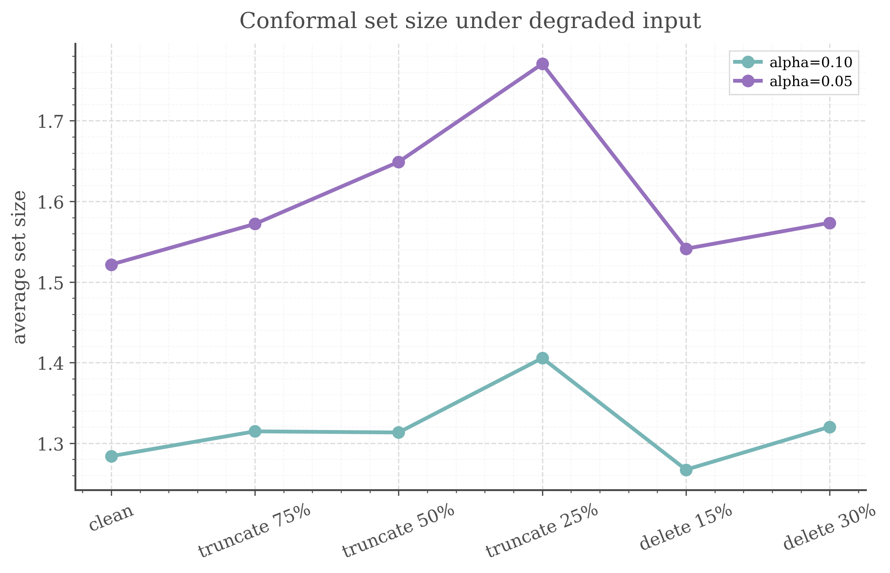

# Uncertainty-Aware Transformer Stress Classification under Degraded Input

A reproducible project on **transformer-based text classification with conformal prediction** under **incomplete or degraded input conditions**.

The project uses the **Dreaddit** dataset for binary stress classification and compares strong lexical baselines against a fine-tuned **DistilBERT** classifier. On top of the transformer, it adds a **split conformal prediction** layer to study how uncertainty-aware outputs behave when the input text is truncated or corrupted. The goal is not benchmark maximisation, but a clean methodological study of **context-sensitive text modelling**, **uncertainty-aware prediction**, and **robust evaluation under non-ideal conditions**.

---

## Motivation of this study

In realistic text processing settings, inputs are often incomplete, noisy, or partially missing. In such settings, it is not enough to report a single clean-test accuracy number. A useful model should also be evaluated under degraded conditions and should be able to express uncertainty rather than always forcing a single confident label.

This project is a methodological study built around three questions:

1. How much does a transformer improve over strong lexical baselines on stress classification?
2. What happens when the test input is truncated or corrupted?
3. Can conformal prediction provide a more cautious output layer under degraded input?

This is a **mental-health-adjacent proxy task**, not a clinical deployment study.

---

## Dataset and Task

**Dataset:** Dreaddit (datasets/asmaab/dreaddit)

**Task:** binary text classification (`stress` vs `not_stress`)

Dreaddit contains long-form Reddit posts annotated for stress. It is a useful public proxy task for studying text classification under incomplete input because the posts are long enough for truncation and corruption stress tests to be meaningful.

---

## Experiment Design

### Models
- **TF-IDF + Logistic Regression**
- **TF-IDF + Linear SVM**
- **DistilBERT** fine-tuned for sequence classification

### Uncertainty Layer
- **Split conformal prediction**
- Applied **only** to the transformer outputs
- Uses a held-out **calibration split**
- Reports:
  - empirical coverage
  - average prediction set size
  - singleton rate
  - empty/full set rates

### Stress Tests
The test set is evaluated under:
- `clean`
- `truncate_75`
- `truncate_50`
- `truncate_25`
- `delete_15`
- `delete_30`

where truncation keeps only the first fraction of the text, and deletion randomly removes a fraction of words.

---

## Main Results

### Clean test performance
The transformer substantially outperforms both lexical baselines on the clean test set.

- **Best baseline (`TF-IDF + Logistic Regression`)**
  - Accuracy: **0.706**
  - Macro-F1: **0.702**

- **DistilBERT**
  - Accuracy: **0.796**
  - Macro-F1: **0.794**

This is a clear gain for a compact transformer setup on a relatively small dataset.



### Performance under degraded input
Performance drops for all models under information loss, but the transformer remains best across all stress settings.

At the same time, the transformer’s advantage narrows under severe truncation:
- `clean test`:
  - baseline macro-F1: **0.702**
  - DistilBERT macro-F1: **0.794**
- `truncate_25`:
  - baseline macro-F1: **0.669**
  - DistilBERT macro-F1: **0.704**

This suggests that the stronger contextual model benefits more from full input, but also loses more when substantial context is removed.



### Conformal prediction under degraded input
On the clean test set, split conformal prediction behaves as expected:

- **alpha = 0.10** (target coverage 90%)
  - empirical coverage: **0.892**
  - average set size: **1.284**
  - singleton rate: **0.716**

- **alpha = 0.05** (target coverage 95%)
  - empirical coverage: **0.948**
  - average set size: **1.522**
  - singleton rate: **0.478**

Under stronger degradation, prediction sets become larger and singleton predictions become less frequent. This is exactly the kind of behaviour we want from an uncertainty-aware output layer under imperfect input.



---

## Interpretation

Three main observations emerge from this study:

1. **Transformers matter:** a fine-tuned DistilBERT provides a strong improvement over lexical baselines on clean text.
2. **Input quality matters:** truncation is more harmful than mild random deletion, and severe truncation substantially narrows the transformer’s advantage.
3. **Uncertainty matters:** conformal prediction does not “fix” degraded inputs, but it does provide a more cautious output layer as the signal becomes weaker.

This is the central methodological point of the project: **evaluation under non-ideal conditions is more informative than clean accuracy alone**.

---

## Repository Structure

```text
dreaddit-conformal-mental-project/
├── configs/
│   └── base.yaml
├── data/
│   └── processed/
├── src/
│   ├── data.py
│   ├── baselines.py
│   ├── transformer.py
│   ├── conformal.py
│   ├── stress_tests.py
│   ├── evaluate.py
│   └── plots.py
├── scripts/
│   ├── prepare_data.py
│   ├── train_baselines.py
│   ├── train_transformer.py
│   ├── conformal_layer.py
│   ├── stress_tests.py
│   └── make_report_assets.py
├── results/
│   ├── tables/
│   └── figures/
├── pyproject.toml
├── uv.lock
└── README.md
```

---

# Reproducibility
This project uses `uv` for environment management.

## Install dependencies
```text
uv sync
```

## Run the pipeline step-by-step
```text
uv run python -m scripts.prepare_data
uv run python -m scripts.train_baselines
uv run python -m scripts.train_transformer
uv run python -m scripts.conformal_layer
uv run python -m scripts.stress_tests
uv run python -m scripts.make_report_assets
```

## Outputs
Key outputs are saved under:
- `results/tables/`
  - clean metrics
  - stress-test classification metrics
  - conformal metrics
  - final summary table
- `results/figures`
  - clean comparison figure
  - stress-test classification figure
  - confrmal figures

---

# known issues and to-do list

do comments on repo structure

do something with .ipynb ... don't know what yet ... (probably exploratory data analysis of whole dreaddit)

think about adding a causal layer and how it lays with project

!!! I've made a grammar mistake in naming functions (src/data/def add_basic_text_features) and (src/stress_tests/def add_basic_features) -> text_lengTH and text_lengHT
**I've fixed it** and moved to utils.py , but fixing will change columns naming in data/processed/*.csv , so after dealing with it **I may rerun** whole pipeline to make final version and results will drift a bit and affecting a README summary

---